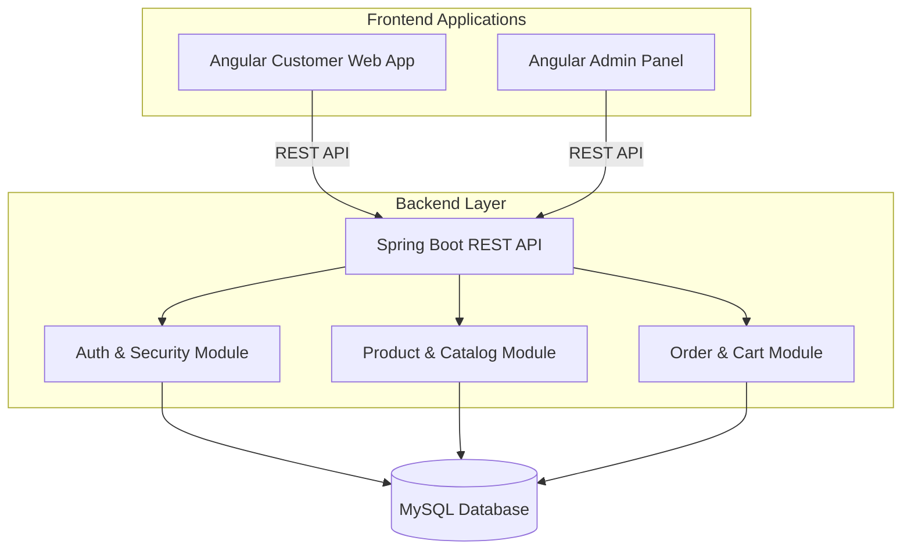

<h1 align="center">
  🏍️ Sun Racing Spirit eCommerce Platform
</h1>

  
  
  
  

A comprehensive, multi-module eCommerce platform designed for Sun Racing Spirit, a premium motorcycle parts retailer. The system provides a seamless shopping experience for customers and a robust management interface for administrators, all powered by a secure and scalable backend architecture.

## 🚀 Key Achievements & Features

* **Dual-Frontend Architecture:** Designed and developed two distinct Angular applications (`sun-racing-spirit-web` for customers and `sun-racing-spirit-admin` for staff) to ensure tailored user experiences and clean separation of concerns.
* **Modular Spring Boot Backend:** Architected a monolithic but highly modular backend separating `business-model`, `data-model`, and `backend` controllers to maintain clean code and facilitate future scalability.
* **Secure Role-Based Access:** Implemented robust authentication and authorization using Spring Security and JWT, strictly dividing customer access from administrative controls.
* **Complete eCommerce Flow:** Engineered end-to-end functionality including dynamic product catalog management, guest and authenticated user shopping carts, order orchestration, and product ratings/reviews.
* **Audit & Monitoring:** Integrated comprehensive audit logging to track system states, order changes, and administrative actions for security and compliance.

## 📐 System Architecture

The ecosystem relies on an API-driven Spring Boot backend that communicates with two distinct front-end Angular applications.

## 🛠️ Tech Stack

**Backend:**
* **Java 17 & Spring Boot 3.2:** Core backend framework for building scalable RESTful services.
* **Spring Data JPA & Hibernate:** For ORM and database interactions.
* **Spring Security & JWT:** For stateless, role-based authentication and secure endpoints.
* **MySQL 8.0:** Relational database for persistent storage (Users, Products, Orders, Carts).
* **Lombok:** Boilerplate and code reduction.

**Frontend:**
* **Angular:** Primary framework for both the Admin Panel and the Customer Web application.
* **TypeScript:** For strongly typed, reliable frontend code.
* **RxJS:** For reactive programming and asynchronous operations.

**Build & Tooling:**
* **Maven:** Dependency management and build automation for the backend.
* **Node.js & npm:** Package management and build tooling for the frontend applications.
